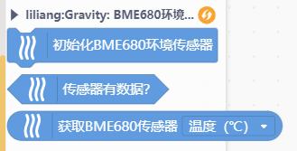
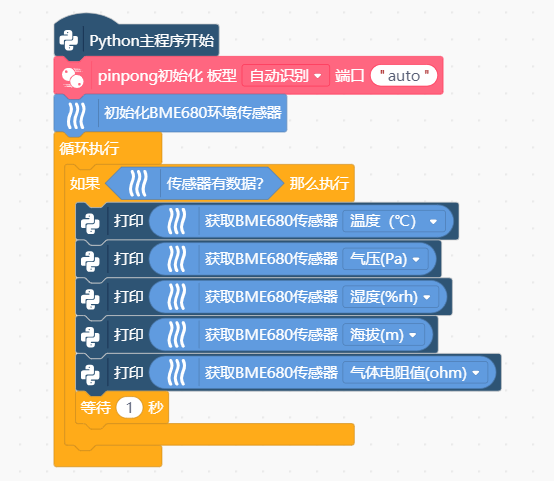

# Gravity: I2C BME680环境传感器 (VOC、温度、湿度、气压)
BME680环境传感器是一款四合一MEMS环境传感器，可测量VOC（挥发性有机物）、温度、湿度、气压这四个参数，非常适用于监测空气质量。由于采用了MEMS技术，该传感器体积小、功耗低，因此也适用于低功耗场合，如可穿戴等。

> **商品链接：** https://www.dfrobot.com.cn/goods-1621.html

# 积木

- **Python模式：**

# 程序示例

# 支持列表

|主板型号|实时模式|ArduinoC|MicroPython|Python|备注|
|-----|-----|:-----:|-----|-----|-----|
|uno||||||
|micro:bit||||||
|mpython||||||
|arduinonano||||||
|leonardo||||||
|mega2560||||||
|unihiker||||√||

# 更新日志

V0.0.1 基础功能完成，支持Python模式

